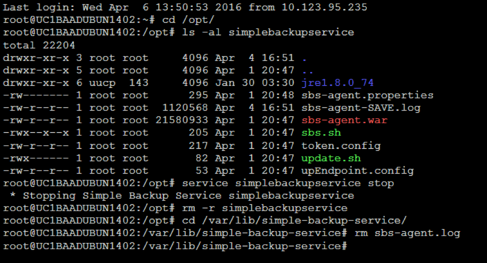

{{{
  "title": "Install the SBS Agent on a Linux Server",
  "date": "06-14-2016",
  "author": "Ryan Brockman",
  "attachments": [],
  "related-products" : [],
  "contentIsHTML": false,
  "sticky": true
}}}

How to Install the SBS Agent on a Linux Server
=============================================================

1. Download the SBS Agent Install script

Download the SBS Agent Install script for Linux . This script must be present and executable on the server that the SBS Agent is going to have the agent installed on. In addition, the server must have internet access to TCP port 443. The Linux script requires that you are root in order to run it. 

`wget https://s3.amazonaws.com/sbs-agent/sbs-linux-install.sh`


2. Uninstall the SBS Agent and cleanup the server (if previously installed)



Run the following commands:

```
# Check for any previous installs of the SBS Agent
cd /opt/
ls -al simplebackupservice

# Stop the Agent.  For RHEL/CentOS use chkconfig.
service simplebackupservice stop      

# Delete the simplebackupservice directory
rm -r simplebackupservice

# Delete the old copy of the sbs-agent.log file
cd /var/lib/simple-backup-service/
rm sbs-agent.log

```

3. Install the SBS Agent

```
./sbs-linux-install.sh <<USER-NAME>> <<ACCT-ALIAS>> <<SERVER-NAME>>  <<DATA-CENTER>> <<SBS.TOKEN>>  <<SBS.UpBaseUrl>>   <<SBS.DistroVersion>>

```


4. Customize the Agent security settings

Accessing the agent on your server will allow you to view details, execute a backup, or execute a restore. To access the agent directly, connect to your CLC server, launch a browser, navigate to `http://localhost:15915`, and view the [Agent Security KB](./sbs-agent-security.md) to obtain credentials. 

Alternatively, you can also [configure the agent for remote access](./sbs-agent-security.md) and connect to the agent from your local computer browser if you have a VPN configured to connect into your CLC servers; the address would be `http://<your servers IP address>:15915` (e.g. `http://10.11.12.13:15915`). [Installing RDP for Linux](./linux-rdp.md) also enables agent access.

For Linux, a local firewall will need to be opened by executing the following commands:

  ```
  firewall-cmd --permanent --add-port=15915/tcp
  firewall-cmd --reload
  ```

5. Verify the Agent Installation in the Agent GUI


