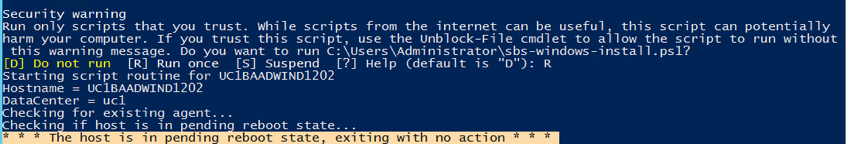

{{{
  "title": "Install the SBS Agent on a Windows Server",
  "date": "06-14-2016",
  "author": "Ryan Brockman",
  "attachments": [],
  "related-products" : [],
  "contentIsHTML": false,
  "sticky": true
}}}

How to Install the SBS Agent on a Windows Server
=============================================================

1. Download the SBS Agent Install script

Download the SBS Agent Install script for Windows. This script must be present and executable on the server that the SBS Agent is going to have the agent installed on. In addition, the server must have internet access to TCP port 443. The Windows script requires that you be an administrator in order to run it.

The default windows download location is Downloads. Open the powershell and cd Downloads to use sbs-windows-install.ps1.

`https://s3.amazonaws.com/sbs-agent/sbs-windows-install.ps1`

2. Uninstall the SBS Agent and cleanup the server (if previously installed)

Open Windows Control Panel and navigate to Programs, Programs and Features.  Find the SimpleBackupService program, and right-click on it to uninstall it.


Then remove any old copies of the Agent log file by deleting it from C:\Windows\System32\config\systemprofile\AppData\Local\simpleBackupService\sbs-agent.log.


3. Install the SBS Agent

Run the windows installer script that you downloaded above.  You will need to replace the variable values (e.g. <<variable>>) in the command line with the appropriate arguments.

```
./sbs-windows-install.ps1  -USERNAME  <<USER-NAME>>  -ACCOUNTALIAS  <<ACCT-ALIAS>>  -SERVERID <<SERVER-NAME>>  -LOCATIONID <<DATA-CENTER>>  -TOKEN <<SBS.TOKEN>>  -UPBASEURL  <<SBS.UpBaseUrl>>   -DISTROVERSION  <<SBS.DistroVersion>>

```

Example:
./sbs-windows-install.ps1  -USERNAME  dan.baas  -ACCOUNTALIAS  BAAD  -SERVERID  UC1BAADWIND1202  -LOCATIONID  UC1  -TOKEN  <<LONG-TOKEN-HERE>>  -UPBASEURL  https://up-dev.backup.ctl.io/clc-backup-bakdat-up/api  -DISTROVERSION  1.15.0


If you are unable to execute the install script, you may need to enable running powershell scripts for the session using this command: `set-executionpolicy unrestricted`

If, after running the powershell command, you see this message about your server being in a pending reboot state then you will first need to reboot your server and then re-run the install script.




4. Customize the Agent security settings

Accessing the agent on your server will allow you to view details, execute a backup, or execute a restore. To access the agent directly, connect to your CLC server, launch a browser, navigate to `http://localhost:15915`, and view the [Agent Security KB](./sbs-agent-security.md) to obtain credentials. 

Alternatively, you can also [configure the agent for remote access](./sbs-agent-security.md) and connect to the agent from your local computer browser if you have a VPN configured to connect into your CLC servers; the address would be `http://<your servers IP address>:15915` (e.g. `http://10.11.12.13:15915`). [Installing RDP for Linux](./linux-rdp.md) also enables agent access.

For Linux, a local firewall will need to be opened by executing the following commands:

  ```
  firewall-cmd --permanent --add-port=15915/tcp
  firewall-cmd --reload
  ```

5. Verify the Agent Installation in the Agent GUI

